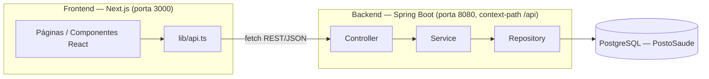

# Arquitetura

## Visão macro

O sistema é dividido em duas aplicações independentes que se comunicam via HTTP/JSON:



- O **frontend** não acessa o banco de dados diretamente; todo o estado é obtido via chamadas REST ao backend (`lib/api.ts`).
- O **backend** expõe uma API REST stateless (sem sessão HTTP), autenticada via **JWT Bearer token**.

## Arquitetura em camadas (backend)

O backend segue a arquitetura tradicional em camadas:

```
Controller
    ↓
Service
    ↓
Repository
    ↓
Database
```

- **Controller** — recebe requisições HTTP, valida entrada (`@Valid`) e delega para a camada de serviço. Não contém regra de negócio.
- **Service** — contém as regras de negócio (ex.: impedir agendamento no passado, impedir CPF/e-mail duplicado, ordenar fila por urgência). Anotado com `@Transactional`.
- **Repository** — interfaces `JpaRepository` (Spring Data JPA) responsáveis pelo acesso a dados, incluindo *query methods* derivados por nome e consultas JPQL customizadas (`@Query`).
- **Model** — entidades JPA mapeadas para as tabelas do PostgreSQL.
- **DTO** — objetos de transferência de dados usados nas requisições/respostas dos controllers, desacoplando o contrato da API do modelo persistido.
- **Exception** — exceções de domínio (`RecursoNaoEncontradoException`, `RegraDeNegocioException`) tratadas globalmente por um `@RestControllerAdvice`.
- **Security** — módulo transversal com autenticação/autorização (JWT), descrito em detalhes em [Autenticação e Autorização](05-autenticacao-autorizacao.md).

## Estrutura de pastas — Backend

```
backend/src/main/java/com/tcc/triagem
├── TriagemApplication.java        # classe main (Spring Boot)
├── controller/                    # endpoints REST
│   ├── AgendamentoController.java
│   ├── AnamneseController.java
│   ├── ConsultaController.java
│   ├── PacienteController.java
│   ├── ProfissionalController.java
│   └── UsuarioController.java
├── service/                       # regras de negócio
│   ├── AgendamentoService.java
│   ├── AnamneseService.java
│   ├── ConsultaService.java
│   ├── PacienteService.java
│   ├── ProfissionalService.java
│   └── UsuarioService.java
├── repository/                    # Spring Data JPA repositories
│   ├── AgendamentoRepository.java
│   ├── AnamneseRepository.java
│   ├── ConsultaRepository.java
│   ├── PacienteRepository.java
│   ├── ProfissionalRepository.java
│   └── UsuarioRepository.java
├── model/                         # entidades JPA
│   ├── Usuario.java                (classe base, herança JOINED)
│   ├── Paciente.java               (extends Usuario)
│   ├── Profissional.java           (extends Usuario)
│   ├── Anamnese.java
│   ├── Agendamento.java
│   ├── Consulta.java
│   └── enums/
│       ├── TipoUsuario.java
│       ├── NivelUrgencia.java
│       └── StatusAgendamento.java
├── dto/                            # DTOs de entrada dos controllers
│   ├── UsuarioDTO.java
│   ├── PacienteDTO.java
│   ├── ProfissionalDTO.java
│   ├── AnamneseDTO.java
│   ├── AgendamentoDTO.java
│   └── ConsultaDTO.java
├── exception/
│   ├── GlobalExceptionHandler.java # @RestControllerAdvice
│   ├── RecursoNaoEncontradoException.java
│   └── RegraDeNegocioException.java
└── security/
    ├── config/SecurityConfig.java
    ├── filter/JwtAuthenticationFilter.java
    ├── controller/AuthController.java
    ├── service/AuthService.java
    ├── service/JwtService.java
    ├── service/UserDetailsServiceImpl.java
    └── dto/ (LoginRequestDTO, LoginResponseDTO, RegisterRequestDTO)
```

> Observação: o README original do projeto menciona também pastas `config` e `util` na raiz de `src`; no código atual essas responsabilidades estão concentradas dentro de `security/config` (não há pacotes `config`/`util` genéricos ainda).

## Estrutura de pastas — Frontend

```
frontend/
├── app/                    # rotas (Next.js App Router)
│   ├── layout.tsx          # layout raiz (HTML/metadata)
│   ├── page.tsx            # redireciona "/" → "/dashboard"
│   ├── dashboard/
│   ├── pacientes/
│   ├── profissionais/
│   ├── anamneses/
│   ├── agendamentos/
│   └── consultas/
├── components/
│   ├── layout/Sidebar.tsx  # navegação lateral
│   └── ui/index.tsx        # design system (Button, Card, Modal, Input, Toast, etc.)
├── lib/
│   ├── api.ts               # cliente HTTP tipado para a API REST
│   └── utils.ts             # formatadores (data, CPF, etc.)
├── types/
│   └── index.ts              # tipos TS espelhando as entidades/DTOs do backend
└── public/                   # assets estáticos
```

Detalhes de cada página em [Frontend](06-frontend.md).

## Stack tecnológica

### Backend (`backend/pom.xml`)

| Item | Versão / detalhe |
|---|---|
| Java | 21 |
| Spring Boot (parent) | 4.0.5 |
| Build tool | Maven (via wrapper `mvnw` / `mvnw.cmd`) |
| Persistência | Spring Data JPA + PostgreSQL (driver `org.postgresql`) |
| Segurança | Spring Security + JWT (`io.jsonwebtoken:jjwt` 0.12.6 — api/impl/jackson) |
| Validação | Jakarta Validation (`spring-boot-starter-validation`) |
| Boilerplate | Lombok |
| Web | `spring-boot-starter-webmvc` |
| Dev | `spring-boot-devtools` |
| Testes | `spring-boot-starter-*-test` (data-jpa, security, validation, webmvc) + JUnit (via starter) |

### Frontend (`frontend/package.json`)

| Item | Versão |
|---|---|
| Next.js | 16.2.1 (App Router) |
| React / React DOM | 19.2.4 |
| TypeScript | ^5 |
| Tailwind CSS | ^4 (`@tailwindcss/postcss`) |
| Lint | ESLint 9 + `eslint-config-next` |

O frontend não usa nenhuma biblioteca de data-fetching/state (React Query, Redux, etc.) nem de formulários — o estado é gerenciado com `useState`/`useEffect` puro e as chamadas HTTP passam por `lib/api.ts`, que usa `fetch` nativo.

## Padrões e decisões de design observados no código

- **DTO pattern**: cada controller recebe um `*DTO` (não a entidade diretamente) para criação/atualização, validado com Bean Validation (`@NotBlank`, `@NotNull`, `@Email`, `@Size`).
- **Tratamento de erro centralizado**: `GlobalExceptionHandler` converte `RecursoNaoEncontradoException` → 404, `RegraDeNegocioException` → 400, erros de `@Valid` → 422, e qualquer outra exceção → 500, sempre em um corpo JSON padronizado (`timestamp`, `status`, `erro`, `mensagem`).
- **Herança JPA `JOINED`**: `Usuario` é a superclasse (tabela `usuarios`); `Paciente` e `Profissional` estendem `Usuario` com `@SuperBuilder` e `@PrimaryKeyJoinColumn`, cada uma em sua própria tabela (`pacientes`, `profissionais`) ligada por chave estrangeira ao id do usuário.
- **Autenticação stateless**: sem sessão HTTP (`SessionCreationPolicy.STATELESS`); autorização por *role* via Spring Security (`hasRole`/`hasAnyRole`) combinada com o token JWT.
- **Fila de triagem via query ordenada**: a ordenação por gravidade não é um campo calculado, é uma consulta JPQL com `CASE` mapeando cada `NivelUrgencia` a uma prioridade numérica (ver [Modelo de Dados](03-modelo-de-dados.md#regra-de-priorização-da-fila)).
