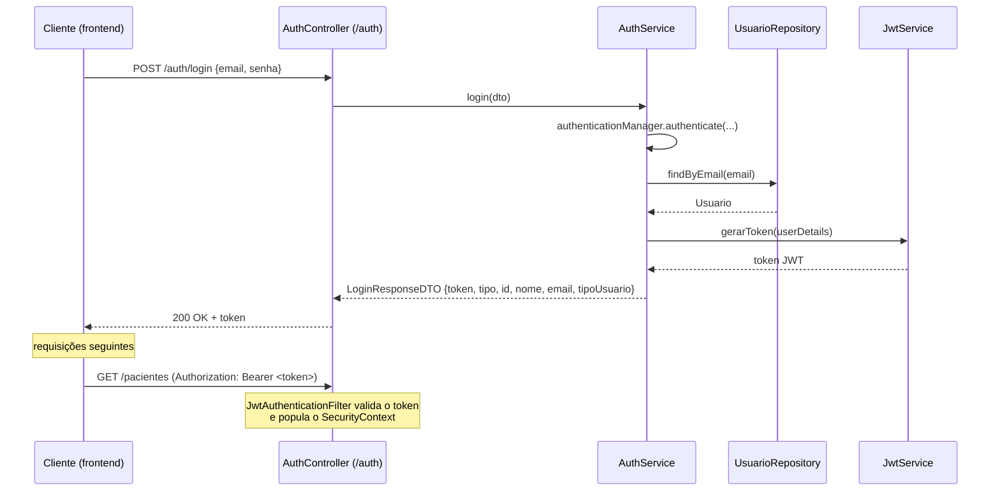

# Autenticação e Autorização

## Visão geral

A API usa **autenticação stateless baseada em JWT** (JSON Web Token). Não há sessão de servidor: cada requisição autenticada carrega um token `Bearer` no header `Authorization`, validado a cada chamada pelo `JwtAuthenticationFilter`.



## Componentes

| Classe | Responsabilidade |
|---|---|
| `AuthController` | expõe `POST /auth/login` e `POST /auth/registrar` |
| `AuthService` | orquestra autenticação (via `AuthenticationManager`) e registro; gera o `LoginResponseDTO` |
| `JwtService` | gera e valida tokens JWT (assinatura HMAC, claims `subject`=e-mail, `issuedAt`, `expiration`) |
| `JwtAuthenticationFilter` | filtro (`OncePerRequestFilter`) que intercepta cada requisição, extrai o token do header `Authorization: Bearer ...`, valida e popula o `SecurityContextHolder` |
| `UserDetailsServiceImpl` | carrega o `Usuario` pelo e-mail e converte `tipoUsuario` em uma *authority* Spring Security no formato `ROLE_<TIPO>` (ex.: `ROLE_ADMIN`) |
| `SecurityConfig` | define a cadeia de filtros, as regras de autorização por rota, CORS (`corsConfigurationSource`), `PasswordEncoder` (BCrypt) e é `STATELESS` |

> **CORS:** a API só libera explicitamente as origens `http://localhost:3000` e `http://127.0.0.1:3000` (onde roda o frontend em desenvolvimento). Sem essa configuração, o navegador bloqueia toda chamada cross-origin antes mesmo dela chegar ao Spring Security — `curl`/Postman não são afetados por CORS, então esse tipo de problema só aparece testando a partir de um navegador de verdade. Ao publicar o frontend em outro domínio, adicione a origem de produção em `corsConfigurationSource()`.

## Perfis de usuário

O enum `TipoUsuario` define três papéis, mapeados para *roles* do Spring Security:

| `TipoUsuario` | Role Spring Security | Perfil descrito na visão geral |
|---|---|---|
| `ADMIN` | `ROLE_ADMIN` | Administração geral do sistema |
| `PROFISSIONAL` | `ROLE_PROFISSIONAL` | Enfermeira, secretária, médico — o "posto de saúde" |
| `PACIENTE` | `ROLE_PACIENTE` | O paciente final |

## Regras de autorização configuradas (`SecurityConfig`)

```java
.requestMatchers("/auth/**").permitAll()
.requestMatchers(HttpMethod.POST, "/pacientes").permitAll()   // auto-cadastro público de paciente
.requestMatchers(HttpMethod.POST,   "/profissionais/**").hasRole("ADMIN")
.requestMatchers(HttpMethod.PUT,    "/profissionais/**").hasRole("ADMIN")
.requestMatchers(HttpMethod.DELETE, "/profissionais/**").hasRole("ADMIN")
.requestMatchers(HttpMethod.DELETE, "/usuarios/**").hasRole("ADMIN")
.requestMatchers(HttpMethod.GET, "/anamneses/triagem").hasAnyRole("ADMIN", "PROFISSIONAL")
.requestMatchers(HttpMethod.GET, "/pacientes/urgentes").hasAnyRole("ADMIN", "PROFISSIONAL")
.anyRequest().authenticated()
```

Em resumo:
- **Público**: `/auth/**` (login e registro genérico) e `POST /pacientes` (auto-cadastro de paciente — é assim que a tela de cadastro do frontend cria uma conta completa, com CPF etc., sem precisar estar logado).
- **Somente `ADMIN`**: gerenciar profissionais (criar/editar/excluir) e excluir usuários.
- **`ADMIN` ou `PROFISSIONAL`**: ver a fila de triagem ordenada por urgência e a lista de pacientes urgentes.
- **Qualquer usuário autenticado** (inclusive `PACIENTE`): todas as demais rotas — incluindo criar/editar/listar pacientes, anamneses, agendamentos e consultas de **qualquer** paciente.

Método (`@EnableMethodSecurity`) está habilitado no `SecurityConfig`, mas atualmente nenhum controller usa `@PreAuthorize` — toda a autorização está centralizada no `SecurityFilterChain`.

## Como autenticar uma chamada

1. `POST /auth/login` (ou `/auth/registrar`) → recebe `{ token, tipo: "Bearer", id, nome, email, tipoUsuario }`.
2. Nas chamadas seguintes, enviar o header:
   ```
   Authorization: Bearer <token>
   ```
3. O token expira em `jwt.expiration` milissegundos (configurado em `application.properties`, atualmente 86400000 ms = 24h). Não há endpoint de refresh — expirado o token, é necessário logar novamente.

## Lacunas conhecidas

Estes pontos são relevantes tanto para continuidade do desenvolvimento quanto para a discussão de "trabalhos futuros" no TCC:

1. **Sem escopo por paciente.** Um usuário do tipo `PACIENTE` autenticado tem acesso de leitura/escrita a **todos** os registros (pacientes, anamneses, agendamentos, consultas de qualquer pessoa), pois as regras de autorização atuais só diferenciam `ADMIN`/`PROFISSIONAL` em algumas rotas específicas — não existe uma regra que restrinja o `PACIENTE` a ver/editar apenas os próprios dados. O frontend (portal do paciente) só consulta/cria dados usando o `id` do próprio usuário logado, mas isso é uma convenção de UI, não uma restrição imposta pelo servidor — nada impede uma chamada direta à API com outro id.
2. **`POST /pacientes` não retorna token.** Diferente de `/auth/login`, o cadastro de paciente não devolve `LoginResponseDTO` — o frontend faz duas chamadas em sequência (`POST /pacientes` seguido de `POST /auth/login`) para completar o auto-cadastro com login automático.
3. **`jwt.secret` está hardcoded** em `backend/src/main/resources/application.properties` (não é uma variável de ambiente), assim como as credenciais do banco (`spring.datasource.username/password`). Adequado para desenvolvimento local, mas deve ser externalizado antes de qualquer deploy real (ver [Guia de Instalação](07-guia-instalacao.md#nota-de-segurança)).
4. **`POST /auth/registrar` continua existindo mas sem uso no frontend.** Cria apenas um `Usuario` genérico (sem CPF/data de nascimento) — útil para criar contas `ADMIN`/`PROFISSIONAL` via API diretamente (é como o admin inicial do sistema é criado hoje, na ausência de uma tela própria para isso), mas não é mais o caminho usado pelo cadastro de paciente.
